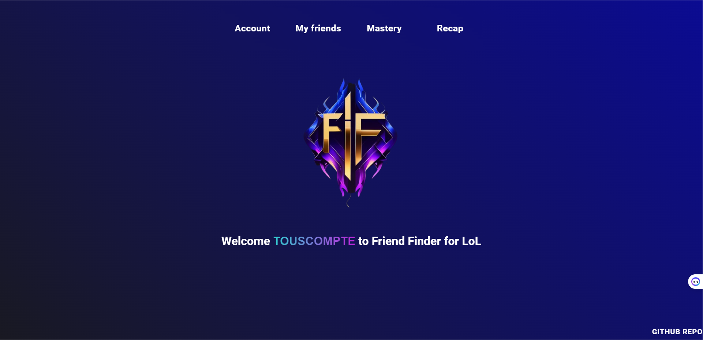
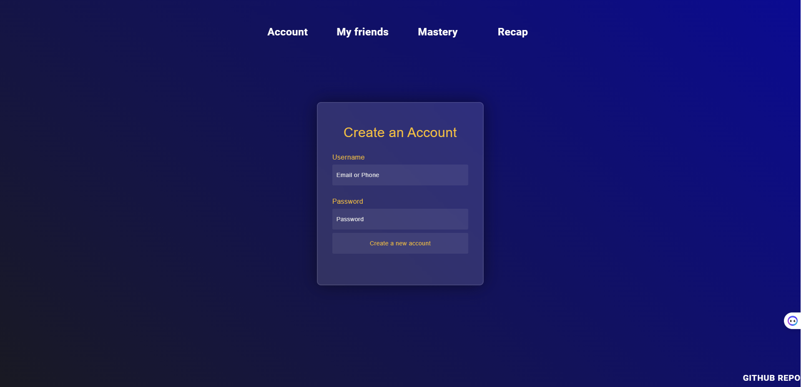
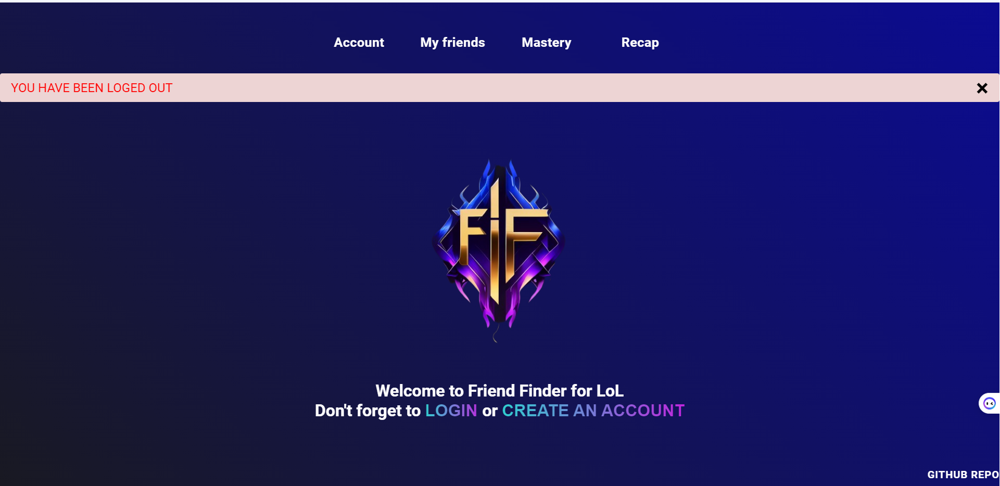
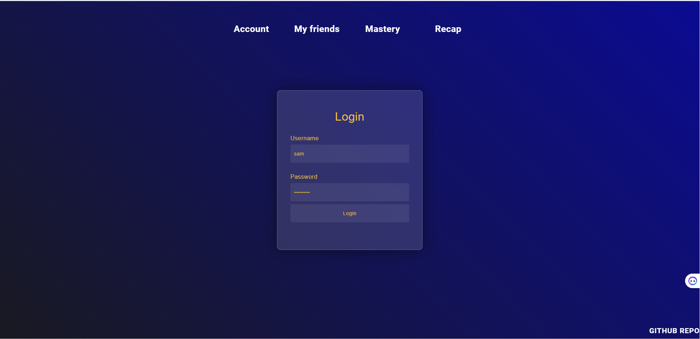
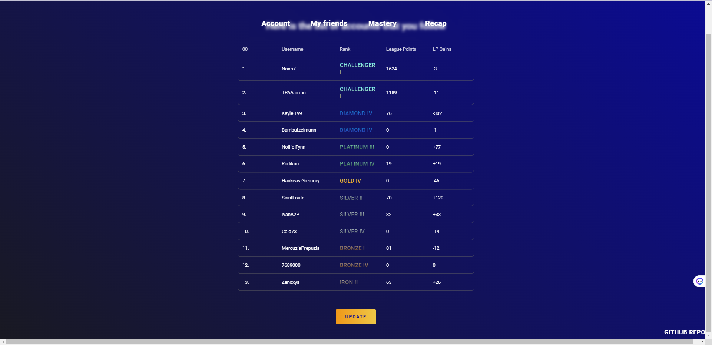
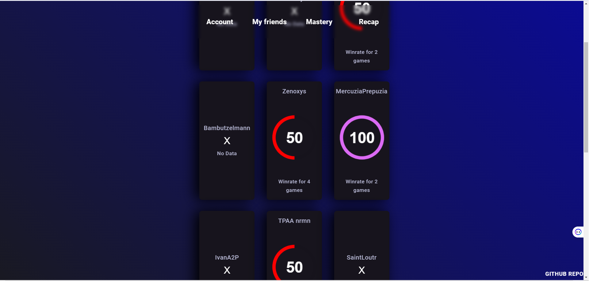
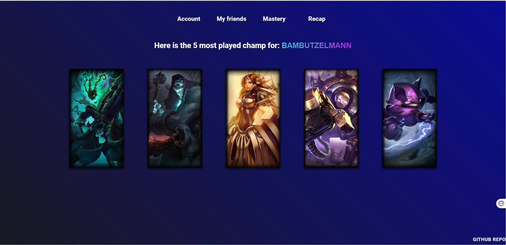
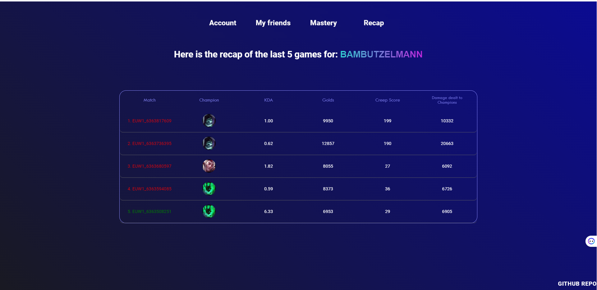
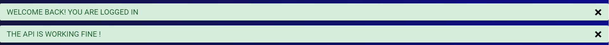

# FriendFinder-for-LoL (FFLoL) / http://sscalbert.pythonanywhere.com/


### 1. [Quick Introduction](#quick-introduction)
### 2. [Authors](#authors) 
### 3. [The Application](#the-application) 
### 4. [The installation guide :](#the-installation-guide)
### 2. [The .ENV file](#the-env-file)
### 2. [A step-by-step guide to launching the application for the first time.](#a-step-by-step-guide-to-launching-the-application-for-the-first-time)


## Quick Introduction

Welcome to the Friend Finder for League of Legends Github repository! This is an open-source application designed to provide League of Legends players with an easy and efficient way to follow their favorite accounts. The application aims to simplify the user experience by providing straightforward information without being weighed down by extraneous features, unlike other popular websites such as op.gg and mobalytics.gg. Our team is excited to share this project with the community.

Riot Games is an American video game developer and publisher known for creating the popular game League of Legends. League of Legends, commonly abbreviated as LoL, is a multiplayer online battle arena game where players compete against each other using unique champions with special abilities in fast-paced, strategic battles.

* **Note: We are currently experiencing a delay in receiving the development API key from Riot. As a result, the API key currently in use is a temporary development key, which may cause limited functionality or errors in the application. If the api is down we will receive an email and upload the new api key, feel free to send an email to friendfinderforlol@gmail.com if there is no changement.**

The site is currently hosted on PythonAnywhere at http://sscalbert.pythonanywhere.com/, a cloud-based Python development and hosting environment.

## Authors

* **Samuel Scalbert** [github](https://github.com/Samuel-Scalbert)
* **Anne Bugner** [github](https://github.com/arlequinte)
* **Maëva Tarantini** [github](https://github.com/MaevaTarantini)

## The Application

The application is divided into 4 tabs:

* The first tab allows you to log in, create an account, or log out of your account. (Author: Samuel)






* The second tab lets you create a list of friends by adding League of Legends summoner names. You can also see your friends' current rank and win/loss LP, click on their name to view their profile on op.gg, and use the "update" button to check if they played ranked games and see if they won or lost LP. There's also a feature that calculates your friends' winrate per day based on the number of games they played. (Author: Samuel)




* The third tab allows you to view your friends' top 5 most played champions and their mastery points. You can hover over the champion image to see the champion name and mastery points. (Author: Maeva)



* The fourth tab lets you retrieve your friend's last 5 matches and view their KDA, gold, minions killed, damage dealt, and champion played (hovering over the champion image shows the champion name). (Author: Anne)



The application also includes flash messages to notify the user if everything is working properly or if the API is down, for example.


## The installation guide

For Windows user you can follow this step-by-step guide: 

* open a cmd window in a directory :
```
C:\Users\desktop\test>
```
* clone the repo
```
C:\Users\desktop\test>git clone https://github.com/Samuel-Scalbert/FriendFinder-for-LoL.git
```
```
C:\Users\desktop\test>cd FriendFinder-for-LoL
C:\Users\samsc\OneDrive\Bureau\test\FriendFinder-for-LoL>
```
* install python 3.10 : https://www.python.org/downloads/windows/

* install the virtual env
```
C:\Users\samsc\OneDrive\Bureau\test\FriendFinder-for-LoL>virtualenv env -p python3
```
* launch the virtual env
```
C:\Users\samsc\OneDrive\Bureau\test\FriendFinder-for-LoL>cd env/Scripts
C:\Users\samsc\OneDrive\Bureau\test\FriendFinder-for-LoL\env\Scripts>activate
(env) C:\Users\samsc\OneDrive\Bureau\test\FriendFinder-for-LoL\env\Scripts>cd ../..
```
* You dont need to install any database, add the .env file in the root directory next to this README.md and fill it with these variables : [Go to the .env section](#the-env-file)
* install the requirements
```
(env) C:\Users\samsc\OneDrive\Bureau\test\FriendFinder-for-LoL>pip install -r requirements.txt
```
* launch the application
```
(env) C:\Users\samsc\OneDrive\Bureau\test\FriendFinder-for-LoL>python run.py
```
* **Note: If at the launch you have any problem with the API you should check [this section](#a-step-by-step-guide-to-launching-the-application-for-the-first-time)**

## The ENV file

The .env file contains crucial information for running the application and must include the following variables: 
* DEBUG=FALSE
* SQLALCHEMY_DATABASE_URI=sqlite:///data_base.db (note that this line may vary depending on your operating system, as we are currently developing on Windows)
* WTF_CSRF_ENABLE=True
* SECRET_KEY=ojzdnaojd. Please be aware that the secret key is accessible in this version of the application, as it only contains accounts created for testing purposes. It is important to note that an online version of the application is also available at this link: http://sscalbert.pythonanywhere.com/.

```
DEBUG=FALSE 
SQLALCHEMY_DATABASE_URI=sqlite:///data_base.db
WTF_CSRF_ENABLE = True 
SECRET_KEY = ojzdnaojd
```

## A step-by-step guide to launching the application for the first time.

* **Note: If you want to test the application locally, you will need to have an API key available by creating a Riot account here: https://developer.riotgames.com/. Alternatively, you can access the application in the cloud, where the key is changed by the creator every day. Additionally, you can send an email to samuel.scalbert@chartes.psl.eu to request access to the API key. The API key as to be changed in this file : [app.py](app/app.py)**

To get started with the application, there is already one pre-filled account called 'touscompte'.

This account is following 13 friend accounts that span across all possible ranks in League of Legends, ranging from Challenger (the top 200 players on each server) all the way to Iron, the lowest rank. This allows you to immediately see how the application works with a variety of ranks and skill levels represented in the friend accounts. Of course, you can also create your own account and add your own friends to fully customize the experience.

```
account name : touscompte
password: password
```

1. On the first tab, you can log in, create an account, or log out of your account.
On the second tab, you can create a list of friends by adding the names of League of Legends summoners. You can view your list of friends and their current rank. 
2. There's also an update button that allows you to check if your friend has played any ranked games and if they've won or lost LP. You can click on their name to go to their profile on op.gg. Additionally, there's a function that allows you to calculate your friends' win rate by day based on the number of games they've played (author: Samuel).
3. On the third tab, you can view the top 5 champions played by your friends, and by hovering over each champion's image, you can view the name of the champion and their mastery points (author: Maeva).
4. On the fourth tab, you can retrieve the last 5 games played by your friends. You can view whether they won or lost, the champion they played, their KDA, gold earned, minions killed, and damage dealt (author: Anne).
